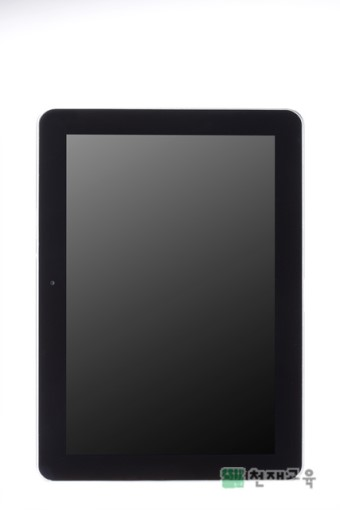

# 정보기기에 관하여

## 1. 정보 기기란?
[**정보 기기**](https://ko.wikipedia.org/wiki/%EC%A0%95%EB%B3%B4_%EA%B8%B0%EA%B8%B0)는 특정한 종류의 정보와 관련 작업을 다루는 데 초점을 맞춘 장치이다. 보통 휴대 전화를 말한다. 이 용어는 인터넷에 접속하는 소비자 제품의 하나인 인터넷 기기와 자주 헷갈리기도 한다.
공부하거나 일을 할 때 다양한 방법으로 자료를 찾아 활용합니다. 이처럼 어떠한 문제를 해결하기 위하여 글자, 사진, 소리, 동영상 등의 자료를 관찰·측정하여 정리한 지식을 정보라고 합니다. 그리고 이러한 정보를 편리하게 활용하고 보관할 수 있게 해 주는 기기를 정보 기기라고 합니다. 

## 2. 정보 기기의 종류와 기능
### 2-1. 정보기기의 종류
	* 컴퓨터
	* 태블릿 컴퓨터
	* 디지털카메라
	* 디지털 캠코더
	* 스마트폰 등등...

### 2-2. 스마트폰과 태블릿 컴퓨터의 구성
	스마트폰은 전화 통화와 인터넷 검색, 동영상과 음악 재생, 애플리케이션 활용 등 다양한 기능이 있으며 크기가 작아 휴대하기 편리합니다. 태블릿 컴퓨터는 스마트폰과 기능은 비슷하지만 크기가 조금 더 큽니다. 스마트폰과 태블릿 컴퓨터는 다음과 같이 구성되어 있습니다.
	
	*스마트폰 
		*수신기: 전화 통화할 때 상대방의 목소리가 들리는 부분입니다.
		*카메라 렌즈: 사진이나 동영상의 화면이 맺히는 곳입니다.
		*소리 조절 버튼: 소리를 크게 하거나 작게 할 때 사용합니다.
		*전원 버튼: 휴대 전화를 완전히 끄거나 켤 때 사용합니다.
		*애플리케이션: 실행할 수 있는 응용 프로그램입니다.
		*터치스크린: 손가락으로 화면을 눌러 조작하고 정보가 출력됩니다.
		*유에스비(USB) 연결 단자: 컴퓨터와 케이블로 연결하여 데이터를 전송합니다.
		*송신기: 전화 통화할 때 소리를 입력합니다.
		*홈 버튼: 홈 화면으로 이동하거나 대기 상태를 해제할 때 사용합니다.
	
	*태블릿 컴퓨터 
		*애플리케이션: 실행할 수 있는 응용 프로그램입니다.
		*카메라 렌즈: 사진이나 동영상의 화면이 맺히는 곳입니다.
		*소리 조절 버튼: 소리를 크게 하거나 작게 할 때 사용합니다.
		*전원 버튼: 태블릿 pc를 완전히 끄거나 켤 때 사용합니다.
		*터치스크린: 손가락으로 화면을 눌러 조작하고 정보가 출력됩니다.

*[출처] : [네이버 지식백과](https://terms.naver.com/entry.nhn?docId=3583013&cid=59160&categoryId=59161)