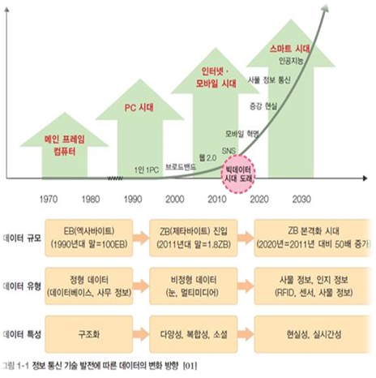
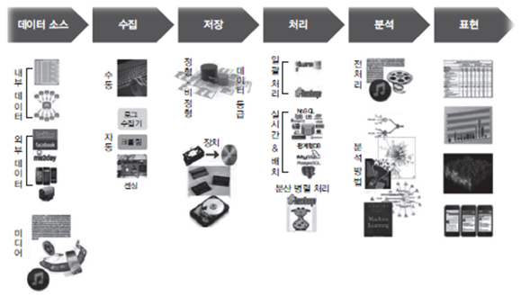

# 빅데이터

######   목차    

    1. 빅데이터의 개요
     1.1 빅데이터란 
     1.2 빅데이터의 특징
     1.3 빅데이터의 분석과정
    
    2. 빅데이터 활용
     2.1 빅데이터 처리 특징
     2.2 빅데이터 활용분야 및 국내외 활용현황
     2.3 빅데이터 활용 기대효과
     2.4 빅데이터 활용사례

------

## 1. 빅데이터의 개요


### 1.1 빅데이터란

>+ 디지털 환경에서 ***생성되는 모든 데이터***를 의미하며, 규모가
>  방대하고 생산주기가 짧은 정보폭발(Information Explosion)이라 정의
>+ 더그레이니(Doug Laney)는 2001년 빅데이터를 3차원 데이터 관리(3D Data Management)로서 통제된 ***자료의 용량(Controlling Data Volume), 속도(Velocity), 다양성(Variety)***이라고 정의




​									**[데이터의 변화 방향]** **시대가 발전하면서 데이터의 양이 증가, 매우 방대해짐**


### 1.2 빅데이터의 특징

   _데이터의 다양성을 기준으로 **정형, 반정형, 비정형** 데이터로 분류_

* **정형 데이터** : 고정된 필드에 저장된 데이터 [ex) 관계형 데이터베이스, 스프레드시트]
* **반정형 데이터** : 고정된 필드에 저장되어 있지 않지만 메타 데이터나 구조를 포함하는 데이터[ex) HTML Text]
* **비정형 데이터** : 고정된 필드에 저장되어 있지 않은 데이터. 텍스트 분석이 가능한 텍스트 문서, 이미지, 동영상 


| 구분              | 전통적 데이터                                                | 빅데이터                                                     |
| ----------------- | ------------------------------------------------------------ | ------------------------------------------------------------ |
| **데이터 원천**   | 전통적 정보 서비스                                           | 일상화된 정보 서비스                                         |
| **목적**          | 업무와 효율성                                                | 사회적 소통, 자기표현, 사회 기반 서비스                      |
| **생성 주체**     | 정부 및 기업 등 조직                                         | 개인 및 시스템                                               |
| **데이터 유형**   | - 정형 데이터<br/>- 조직 내부 데이터(고객 정보, 거래 정보)<br/>- 주로 비공개 데이터 | - 비정형 데이터(비디오 스트림, 이미지,<br/> 오디오, 소셜 네트워크 등 사용자 데이터,<br/> 응용 프로그램 데이터 등) <br/>- 조직 외부 데이터<br/>- 일부 공개 데이터 |
| **데이터 특징**   | - 데이터 증가량 관리 가능 <br/>- 신뢰성 높은 핵심 데이터     | - 기하급수로 양적 증가<br/>- 쓰레기(Garbage) 데이터 비중 높음<br/>- 문맥 정보 등 다양한 데이터 |
| **데이터 보유**   | 정부, 기업 등 대부분 조직                                    | - 인터넷 서비스 기업(구글, 아마존 등)<br/>- 포털(네이버, 다음 등)<br/>- 이동 통신 회사(SKT, KTF 등)<br/>- 디바이스 생산 회사(애플, 삼성전자 등) |
| **데이터 플랫폼** | 정형 데이터를 생산 · 저장 · 분석 · 처리<br/>할 수 있는 전통적 플랫폼<br/>예) 분산 DBMS, 다중처리기, 중앙 집중 처리 | 비정형 대량 데이터를 생산 생산 · 저장 · 분석 · 처리<br/>할 수 있는 새로운 플랫폼<br/>예) 대용량 비정형 데이터 분산 병렬 처리 |


### 1.3 빅데이터 분석과정

- 빅데이터 분석 과정에서 가장 우선되어야 하는 것은 데이터를 어디로부터 가져오는가(Where), 데이터 분석 결과가 왜 필요한가(Why), 누구를 위해 사용할 것인가(Who)를 정의하여 활용 기준을 삼는 것

- 일반적으로 많이 사용되는 분석 방법은 **Eye Tracking, 로그 분석(Goole Analytics), Scrolling Heatmap Analysis, Confetti Analysis, Video Recording Analysis, On-line 포털사이트, SNS, Community** 등



​							**[데이터 처리 과정]** 


```
- 텍스트 마이닝 : 비정형 텍스트에서 유용한 정보를 추출, 텍스트에 숨겨진 의미와 정보를 찾아내는 방법
- 웹 마이닝 : 인터넷에서 수집한 정보를 데이터 마이닝 기법으로 분석
- 오피니언 마이닝 : 콘텐츠에 표현된 의견들을 분석, 텍스트 내의 감정과 상태를 분석하는데 사용(바이럴)
- 리얼리티 마이닝 : 휴대용 기기들을 활용하여 소비자들의 행동을 추론
- 소셜 네트워크 분석 : 그래프를 기반으로 소셜 서비스의 연결 구조와 강도를 분석하여 소비자의 영향력 분석 
- 분류 및 군집화 : 알려진 클래스들을 분류 추가되는 데이터를 속할 만한 데이터 군으로 나누는 방법 이들을 
                 다시 비슷한 데이터로 그룹화하는 방법이 군집화
- 기계 학습 : 인공지능 분야에서 인간의 학습 방법을 모델링하는 것으로 컴퓨터가 학습할 수 있도록 하는 
             알고리즘과 기술을 개할하여 수신한 정보를 판단하는 방법
```

------

## 2. 빅데이터의 활용


### 2.1 빅데이터 처리 특징

* 의사결정의 속도에서 신속한 의사결정이 상대적으로 덜 요구되어 장기적이고 전략적인 접근 필요
* 처리 복잡도는 다양한 데이터 소스, 복잡한 로직 처리, 대용량 처리로 처리 복잡도가 높아 분산처리 기술 필요
* 처리할 데이터 규모가 방대하여 수집 및 분석을 장기간에 걸쳐 수행해야 하므로 데이터 양이 방대
* 비정형 데이터의 비중이 높아 소셜미디어 데이터, 로그 파일, 스트림 데이터, 콜센터 로그 등 비중이 높음
* 분석의 유연성 측면에서 처리나 분석 유연성이 높고 실시간 처리가 보장되어야 하는 데이터 분석에는 부적합


### 2.2 빅데이터 활용분야

| 공공 분야         | *방대한 양의 데이터로 수자원 관리, 스마트 그리드, 재난 방재 영역을 포괄적으로 포함* |
| ----------------- | ------------------------------------------------------------ |
| **과학 분야**     | ***흩어진 과학 데이터를 국가 차원에서 수집, 가공, 유통, 재활용 할 수 있는 기반을 마련*** |
| **의료 분야**     | ***의료기록의 전자화, 병원 간 연구 데이터 공유로 빅데이터 도입과 활용이 확대*** |
| **도소매 분야**   | ***빅데이터 분석으로 수요예측 및 선제적 경영 지원에 초점***  |
| **제조 분야**     | ***보유 데이터양이 많고, 불량품 개선비용 등의 적용효과를 계량화 . 빅데이터의 유용성 확인*** |
| **정보통신 분야** | ***이동통신의 발전, 개인 단말기의 증가로 생성된 디지털 공간의 개인 데이터로 목표 마케팅, 개인화 서비스 확대*** |


### 2.3 빅데이터 활용 기대효과

* 이상 현상 감지로서 업무에서 발생하는 이벤트를 기록하여 정상 혹은 비정상 상태를 표시하는 패턴을 파악, 이 패턴을 기초로 새로운 이벤트가 발생할 경우 이상 현상 여부를 판단
* 마케팅 분야에도 활용 가능하고, 고객 이탈을 사전에 감지하거나 위키 리스크 데이터 분석으로 효과적인 전술정보 제공. 아마존 닷컴의 추천 상품 표시, 구글 및 페이스북의 맞춤형 광고 등이 대표적


### 2.4 빅데이터 활용사례

* 고객맞춤형
  * 신한카드 : 카드 이용자의 패턴 분석으로 최적화된 맞춤형 마케팅 전략을 수립하여 효과를 보고있음
  * 올레TV : 맞춤형 콘텐츠 추천은 콘텐츠 종류가 다양화, 세분화되면서 생기는 어려움이나 불편함 해소

* 기업전략형
  * 자라 : 의류업체로서 저가격, 스피드, 패션성, 고품질, 신뢰성을 바탕으로 차별화, 소비자로부터 각광
  * 카탈리나 : 기타 유통업체가 소비자를 대상으로 효율적인 마케팅을 할 수 있도록 지원, 데이터 2.5 페타

* 제품추천형
  * 노스페이스 :  노스페이스의 상품추천
  * K쇼핑 : K쇼핑의 상품추천. T-커머스에 접목하여 보다 혁신적인 서비스를 선보이기 위해 맞춤형 상품 기획