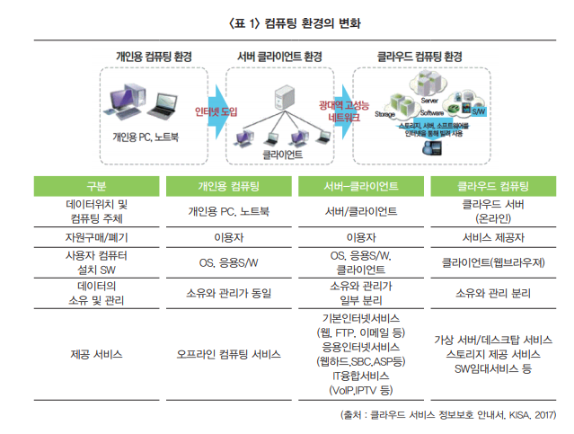
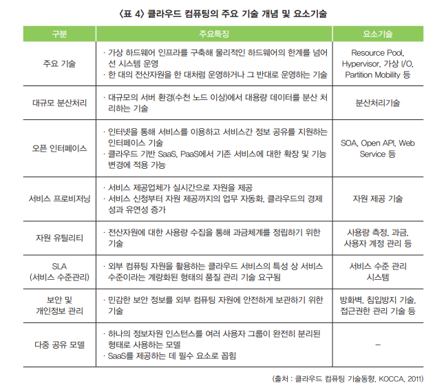

---
## 클라우드 컴퓨팅  

### 정의

구름(cloud)와 같이 무형의 형태로 존재하는 하드웨어·소프트웨어 등의 컴퓨팅 자원을 자신이 필요한 만큼 빌려 쓰고 이에 대한 사용요금을 지급하는 방식의 컴퓨팅 서비스로, 서로 다른 물리적인 위치에 존재하는 컴퓨팅 자원을 가상화 기술로 통합해 제공하는 환경을 말함

### 클라우드 컴퓨팅 작동 방식
1. IT전문가와 개발자가 쉽게 리소스를 주문하고 계정을 관리 할 수 있도록 **브라우저 기반의 친숙한 대시보드를 제공**
1. 일부 클라우드 컴퓨팅 서비스는 REST API 및 명령줄 인터페이스에서 작동하도록 설계되어 개발자에게 여러 가지 옵션을 제공하기도 함

---

### 클라우드 컴퓨팅의 변화  

------

### 클라우드 컴퓨팅 유형

1. **공용 클라우드** : 인터넷을 통해 서버 및 저장소와 같은 컴퓨팅 리소스를 제공하는 타사가 소유하고 운용, 사용자가 이러한 서비스에 액세스하고 계정을 관리
2. **사설 클라우드** : 비지니스 또는 조직에서 독점적으로 사용되는 클라우드 컴퓨팅 리소스,, 서비스와 인프라가 개인 네트워크에서 유지 관리되는 클라우드임
3. 하이브리드 클라우드 : 공용 클라우드와 사설 클라우드의 결합,, 데이터 및 응용 프로그램을 사설 클라우드와 공용 클라우드 간에 이동할 수 있도록 하여, 비즈니스에 유연성과 더 많은 개발옵션을 제공하며 기존 인프라와 보안 규정 준수를 최적화 하도록 지원함

------

### 클라우드 컴퓨팅의 분류 및 활용

- IaaS (infrastructure-as-a-Service) : 서버, 스토리지, 네트워크 등 인프라 자원을 사용한 기반으로 제공하는 서비스
- PaaS (Platform-as-a-Service) : 개발자가 자신의 어플리케이션을 개발, 테스트, 실행할 수 있는 컴퓨팅 플랫폼을 제공하는 서비스
- SaaS (Software-as-a-Service) : 소프트웨어/어플리케이션을 제공하는 목적으로 만들어진 모델, 표준화된 어플리케이션 프로세스를 제공하는 서비스

------

### 클라우드 컴퓨팅 분류

**1. 서비스 유형**

|                  구분                   |                           주요특징                           |
| :-------------------------------------: | :----------------------------------------------------------: |
| IaaS   (Infrastructure as a Service) | 이용자에게 서버, 스토리지 등의 하드웨어 자원만을 임대·제공하는 서비스 |
|    PaaS   (Platform as a Service)    | 이용자에게 소프트웨어 개발에 필요한 플랫폼을 임대·제공하는 서비스 |
|     SaaS   (Software as Service)     |      이용자가 원하는 소프트웨어를 임대·제공하는 서비스       |

**1. 서비스 운용 형태**

|     구분      |                           주요특징                           |
| :-----------: | :----------------------------------------------------------: |
| Private Cloud | 기업 및 기관 내부에 클라우드 서비스 환경을 구성하여 내부자에게 제한적으로 서비스를 제공하는 형태 |
| Public Cloud  | 불특정 다수를 대상으로 하는 서비스로 여러 서비스 사용자가 이용하는 형태 |
| Hybrid Cloud  | - 퍼블릭 클라우드와 프라이빗 클라우스 결합 형태   - 공유를 원하지 않는 일부 데이터 및 서비스에 대해 프라이빗 정책을 설정하여 서비스를 제공 |

------

### 클라우드 컴퓨팅을 적용한 서비스 사례

- 구글(Google)이 제공하는 '구글 드라이브'
- 카카오(KaKao)가 제공하는 '카카오내비'
- 폴라리스오피스가 제공하는 '폴라리스오피스'
- 더존이 제공하는 '더존 Smart Clound Edition'
- 아마존이 제공하는 '아마존 웹서비스(AWS)'

### 클라우드 컴퓨팅의 주요 기술 개념 및 요소기술

------

###클라우드 컴퓨팅의 용도

1. 새로운 앱 서비스 만들기
2. 응용 프로그램 테스트 및 빌드
3. 데이터 저장, 백업 및 복구
4. 데이터 분석
5. 오디오 및 비디오 스트리밍
6. 인텔리전스 포함
7. 주문형 소프트웨어 제공

------

### 클라우드 컴퓨팅의 장점

- 초기 구입 비용, 비용 지출이 적음
- 컴퓨터 가용율이 높다
- 서비스를 통한 일관성 있는 사용자 환경 구현 가능
- 신뢰성이 높은 서버에 보관함으로써 안전하게 보관가능
- 전문적인 하드웨어 지식없이 쉽게 사용 가능

------

### 클라우드 컴퓨팅의 단점

- 공격 당할 경우 개언정보 유츌될 수 있음
- 미리 백업이 않된 정보는 복구가 안되는 경우도 있음
- 애플리케이션을 설치하는 데 제약이 심하거나 새로운 애플리 케이션을 지원하지 않음
- 통신환경이 열악하면 서비스 받기 어려움
- 개별 정보가 물리적으로 어디에 위치하고 있는지 파악할 수 없음
