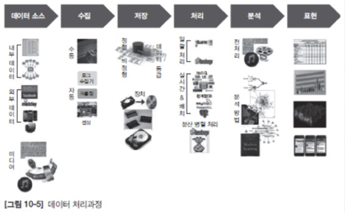

# 빅데이터의 개요

### 빅데이터란?

* 디지털 환경에서 생성되는 모든 데이터를 의미

---

### 빅데이터의 특징

|     구분      |    전통적 데이터    | 빅데이터 |
| :-----------: | :-----------------: | :------: |
|  데이터 원천  | 전통적 정보 서비스  | 일상화된 정보 서비스 |
|     목적      |    업무와 효율성    | 사회적 소통, 자기표현, 사회 기반 서비스 |
|   생성 주체   | 정부 및 기업등 조직 | 개인 및 시스템 |
|   데이터 유형   |  정형 데이터   조직 내부 데이터(고객정보,거래 정보 등)   주로 비공개 데이터  | 비정형 데이터  조직 외부 데이터  일부 공개 데이터 |
|   데이터 특징   | 데이터 증가량 관리 가능   신뢰성 높은 핵심 데이터 | 기하급수로 양적 증가  쓰레기 데이터 비중 높음  문맥 정보 등 다양한 데이터 |
|   데이터 보유   | 정부, 기업 등 대부분 조직 | 인터넷 서비스 기업  포털  이동 통신 회사  디바이스 생산 회사 |
|   데이터 플랫폼   | 정형 데이터를 생산, 저장, 분석, 처리할 수 있는 전동적 플랫폼 | 비정형 대량 데이터를 생산, 저장, 분석, 처리할 수 있는 새로운 플랫폼 |

---

### 빅데이터 분석과정

* **처리 과정**
  * 

* **주로 사용되는 분석 방법**
  * Eye Tracking
  * 로그 분석
  * Scrolling Heatmap Analysis
  * Confetti Analysis
  * Video Recording Analysis
  * On-line 포털사이트
  * SNS
  * Community

* **분석 방법**
* **텍스트 마이닝(Text Mining)** :　비정형 텍스트에서 유용한 정보를 추출하거나 다른 데이터의 연계성을 파악하여 분류나 군집화 등을 통해서 텍스트에 숨겨진 의미와 정보를 찾아내는 방법
  * **웹 마이닝(Web Mining)** : 인터넷에서 수집한 정보를 데이터 마이닝 기법으로 분석하는 방법
  * **오피니언 마이닝(Opinion Mining)** : 온라인 뉴스나 소셜미디어의 댓글 또는 사용자가 생성한 콘텐츠에 표현된 의견들을 분석해내는 방법, 텍스트 내의 감정과 상태를 분석하는데 사용, 이를 대부분 바이럴(Viral)이라 한다.
  * **리얼리티 마이닝(Reality Mining)** : 휴대용 기기들을 활용하여 소비자들의 행동을 추론하는 방법으로 통화 정보 등을 기반으로 소비자들의 행동 특성을 추출
  
* **소셜 네트워크 분석(Social Network Analysis)** : 그래프(Graph Theory)를 기반으로 소셜 네트워크 서비스의 연결 구조와 연결 강도를 분석하여 소비자의 영향력 등을 분석하는 방법
  * **분류(Classification) 및 군집화(Clustering)** : 미리 알려진 클래스들을 분류하고 새로이 추가되는 데이터를 속할 만한 데이터 군으로 나누는 방법이며, 이들을 다시 비슷한 데이터로 그룹화하는 방법이 군집화이다.
  * **기계 학습(machin Learning)** : 인공지능 분야에서 인간의 학습 방법을 모델링하는 것으로 컴퓨터가 학습할 수 있도록 하는 알고리즘과 기술을 개발하여 수신한 정보를 판단하는 방법, 여기에 의사 결정 트리(Decision), 베이지언(Bayesian), 마르코프(Markov) 등이 있다.

---

### 빅데이터 활용이란?

* 대용량의 데이터를 분석하여 가치 있는 정보를 추출하고, 생성된 지식을 바탕으로 능동적으로 대응하거나 변화를 예측하기 위한 정보화 기술을 의미

---

### 빅데이터 활용분야

* **공공분야** : 국가적 차원에서 방대한 양의 데이터로 수자원 관리, 스마트 그리드, 재난 방재 영역 등을 포괄적으로 포함
* **과학분야** : 산발적으로 흩어진 과학 데이터를 수집, 가공, 유통, 재활용할 수 있는 기반을 마련
* **의료분야** : 의료기록의 전자화, 병원 간 연구 데이터 공유로 빅데이터 도입과 활용이 확대
* **도소매분야** : 빅데이터 분석으로 수요예측 및 선제적 경영 지원에 초점
* **제조분야** : 불량품 개선비용 등의 적용효과를 계량화
* **정보통신분야** : 이동통신의 발전과 개인 단말기의 증가로 생성된 디지털 공간의 개인 데이터로 목표 마케팅, 개인화 서비스 확대

---

### 빅데이터활용 기대효과

* 업무에서 발생하는 이벤트를 기록하여 패턴을 파악하고, 이 패턴을 기초로 새로운 이벤트가 발생할 경우 다음 이벤트를 예측
