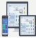

# 클라우드 컴퓨팅

## 1. 클라우드 컴퓨팅 개요

**클라우드 컴퓨팅(Cloud Computing)**

- 인터넷 기반 컴퓨팅 기술
- 개인 단말기는 주로 입출력만 이루어지고, 정보 분석 및 처리, 저장, 관리 유통 등은 클라우드 공간에서 이루어지는 컴퓨팅 시스템

## 2. 클라우드 컴퓨팅 분류 

클라우드 컴퓨팅은 서비스 유형 및 서비스 운용형태에 따라서 다음과 같이 구분됨

- 서비스 유형
  - IaaS(Infrastructure-as-a-Service) : 서버, 스토리지, 네트워크 등 인프라 자원을 사용량 기반으로 제공하는 서비스
  - PaaS(Platform-as-a-Service) : 개발자가 자신의 어플리케이션을 개발, 테스트, 실행할 수 있는 컴퓨팅 플랫폼을 제공하는 서비스
  - SaaS(Software-as-a-Service) : 소프트웨어/어플리케이션을 제공하는 목적으로 만들어진 모델, 표준화된 어플리케이션 프로세스를 제공하는 서비스 

- 서비스 운용 형태 
  - Private Cloud: 기업 및 기관 내부에 클라우드 서비스 환경을 구성하여 내부자에게 제한적
으로 서비스를 제공하는 형태
  - Public Cloud : 불특정 다수를 대상으로 하는 서비스로 여러 서비스 사용자가 이용하는 형태 
  - Hybrid Cloud  : 퍼블릭 클라우드와 프라이빗 클라우드 결합 형태,공유를 원하지 않는 일부 데이터 및 서비스에 대해 프라이빗 정책을 설정하여 서비스를 제공

## 3.클라우드 컴퓨팅 장단점

### 3.1 장점

- 초기 구입 비용과 비용 지출이 적으며 휴대성이 높음
- 컴퓨터 가용율이 높음
- 다양한 기기를 단말기로 사용하는 것이 가능
- 서비스를 통한 일관성 있는 사용자 환경을 구현 가능
- 사용자의 데이터를 신뢰성 높은 서버에 보관함으로써 안전하게 보관 가능
- 전문적인 하드웨어에 대한 지식 없이 쉽게 사용 가능

### 3.2 단점

- 서버가 공격 당하면 개인정보가 유출될 수 있음
- 재해에 서버의 데이터가 손상되면, 백업하지 않은 정보 복구 불가
- 애플리케이션 설치 제약, 새로운 애플리케이션 미지원
- 열악한 통신환경에서의 서비스 이용 어려움
- 개별 정보가 물리적인 위치 파악 불가

## 4. 클라우드 컴퓨팅 활용사례
| 구분 | 주요특징 |
| ------------ | ------------- |
|  | 구글(Google, 미국)社가 제공하는 구글드라이브 |
| | 이용자는 클라우드에 접속하여 각종 파일을 저장·확인하고, 다른 사람들과 공유할 수 있음 |
|  | 카카오(Kakao, 한국)社가 제공하는 ‘카카오내비’ |
| | 이용자는 스마트폰에 지도를 다운로드하지 않고 클라우드에 접속하여 내비게이션 서비스를 이용 할 수 있음 |
|  | 폴라리스오피스(Polaris office, 한국)社가 제공하는 ‘폴라리스오피스’ |
| | 클라우드 환경에서 작동되는 오피스(문서편집 등) 프로그램으로, 이용자는 스마트폰 등에 여러 개의 오피스 프로그램을 설치하지 않고, 폴라리스오피스가 제공하는 클라우드 기반 프로그램을 활용 하여 다양한 형태의 문서 파일을 읽고, 작성하고, 편집할 수 있음 |
|  | 더존(Duzon, 한국)社가 제공하는 ‘더존 Smart A Cloud Edition’ |
| | 이용자는 클라우드에 접속하여 기업 회계업무 시스템 등을 실시간으로 사용하여 업무를 처리할 수 있음 |
|  | 아마존(amazon, 미국)社가 제공하는 ‘아마존 웹서비스(AWS)’ |
| | AMS는 서버, 스토리지, 네트워크 장비 등을 대량으로 구축해 놓고 이용자들에게 인프라 형태로 서비스(Infra as a Service)하고 있음 |
| | AWS의 주요 이용자는 기업, IT개발자 등임 |

## 5. 출처

1. 클라우드 컴퓨팅 분류 
  - 과학기술일자리진흥원 기술동향보고서 
  - 최근 클라우드 컴퓨팅 서비스 동향,KISA,강원형

2. 클라우드 컴퓨팅 활용 사례
  - 클라우드 컴퓨팅의 현황과 과제, 국회입법조사처, 2017
