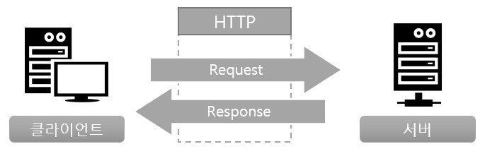

> 웹 동작 원리 

# 웹 서버 구축

> 이 문서는 웹 사이트/웹 애플리케이션을 구축하기 위해서 알아야 하는 웹 기초 지식을 설명합니다. 

## 웹의 구조와 HTTP 통신의 기본

- 웹 애플리케이션이란?
- 웹 서버에 대한 요청과 응답
- 웹 서버 접속과 URL 서식
- IP 주소와 도메인 이름
- HTTP 통신의 구조

---
### 1. 웹 애플리케이션이란?

**웹 애플리케이션**이란 인터넷과 인트라넷 등의 네트워크를 통해서 웹 브라우저를 사용하고 조작하는 애플리케이션을 의미합니다.

- 기업이나 개인 홈페이지  
- 블로그  
- 뉴스나 동영상 전송  
- SNS상의 교류  
- 온라인 쇼핑  
- 은행 인터넷 뱅킹  
- 증권 회사의 온라인 트레이드   

#### 1.1. 웹 애플리케이션

**웹 애플리케이션**은 브라우저에서 애플리케이션에 접근하면, 네트워크상에 있는 Web 서버에서 프로세싱하고 프로세싱 결과를 브라우저에 표시합니다.  
서버에 대한 네트워크 통신이 가능한 환경에서 브라우저만 있으면 접근할 수 있기 때문에, 컴퓨터, 스마트폰/태블릿 등 플랫폼에 관계없이 이용할 수 있는 것이 특징입니다.  

#### 1.2. 네이티브 애플리케이션

**네이티브 애플리케이션**은 설치한 단말기상에서 프로세싱이 실행됩니다.  애플리케이션의 구동은 실행하는 하드웨어와 운영체제에 의존하기 때문에 동일한 기능을 하는 애플리케이션이라도 플랫폼 마다 개발해야 합니다.
안드로이드의 경우는 Java, IOS의 경우는 Swift, 컴퓨터의 경우는 C++과 C# 등의 언어로 개발합니다.

<표 1> 웹 애플리케이션과 네이티브 애플리케이션의 차이

|구분|웹 애플리케이션|네이티브 애플리케이션|
|---|---|---|
|실행환경|서버|클라이언트|
|설치|불필요(브라우저)|전용 마켓에서 다운로드/설치|
|장점|어떤 플랫폼에서도 이용 가능|네트워크가 없어도 이용 가능/프로세싱 성능이 높음|
|단점|네트워크가 필수/성능이 낮음|플랫폼 마다 개발이 필수|

### 2. 웹 서버에 대한 요청과 응답

웹 애플리케이션에서는 웹 서버상에서 공개된 파일이나 프로그램을 브라우저를 통해 호출하기만 하면 이용자가 원하는 정보를 조회할 수 있습니다.

- **요청**
   - 웹 브라우저가 웹 애클리케이션에게 어떠한 프로세싱을 의뢰하는 것

- **응답**
   - 이용자의 브라우저로부터 요청을 받은 웹 애플리케이션은 지정된 파일이나 동영상을 이용자의 브라우저로 송신합니다.
   - 웹 서버에서 브라우저로 프로세싱 결과를 송신하는 것
   

### 3. 웹 서버 접속과 URL 서식

### 4. IP 주소와 도메인 이름

### 5. HTTP 통신의 구조

