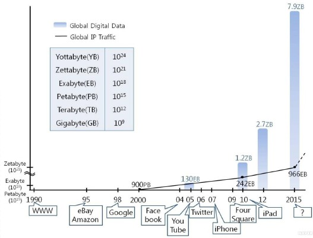
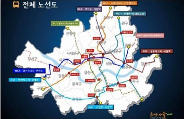

> 클라우드/빅데이터

# 클라우드/빅데이터 개념


> *이 문서는 클라우드/빅데이터를 구축하기 위해서 알아야 하는 기초 지식을 설명합니다.<br>*

````markdown
    - 클라우드 개념
    - 빅데이터 개요
    - 빅데이터 활용 사례
````
---

## 1. 클라우드 개념

### 1.1 클라우드 개요

**클라우드 컴퓨팅(Cloud Computing)**

- 인터넷 기반 컴퓨팅 기술
- 개인 단말기는 주로 입출력만 이루어지고, 정보 분석 및 처리, 저장, 관리, 유통 등은 클라우드 공간에서 이루어지는 컴퓨팅 시스템

  

### 1.2 클라우드 장점

- 초기 구입 비용과 비용 지출이 적으며 휴대성이 높음
- 컴퓨터 가용율이 높음
- 다양한 기기를 단말기로 사용하는 것이 가능
- 서비스를 통한 일관성 있는 사용자 환경을 구현 가능
- 사용자의 데이터를 신뢰성 높은 서버에 보관함으로써 안전하게 보관 가능
- 전문적인 하드웨어에 대한 지식 없이 쉽게 사용 가능


### 1.3 클라우드 단점

- 서버가 공격 당하면 개인정보가 유출될 수 있음
- 재해에 서버의 데이터가 손상되면, 백업하지 않은 정보 복구 불가
- 애플리케이션 설치 제약, 새로운 애플리케이션 미지원
- 열악한 통신환경에서의 서비스 이용 어려움
- 개별 정보가 물리적인 위치 파악 불가

---

## 2. 빅데이터 개요

### 2.1 빅데이터 정의

그 전에는 분석이 불가능 했지만, IT가 발전하면서 다룰 수 있게 된 방대한 양의 데이터

 *예) 휴대폰 통화 내역, 기상 정보, 실시간 교통량, 인터넷 검색 내역, 소셜네트워크서비스 메시지 등*


##### 글로벌 데이터 규모 변화

- 2012년 2.7 제타바이트
- 2015년 7.9 제타바이트

 *1 제타바이트(zettabyte) = 1000엑사바이트(exabyte)*<br>
 *1 엑사바이트 = 미 의회도서관 인쇄물의 10만배 정보량*


<그림 01> 인터넷 기업의 등장과 글로벌 디지털 데이터 규모




### 2.2 빅데이터 특징

- 데이터의 양(Volume)
- 데이터 생성 속도(Velocity)
- 형태의 다양성(Variety)

*빅데이터 속에서는 이름이나 주민등록번호와 같은 개인식별정보, 성별, 나이, 직업과 같은 정형적인 특성보다는*
*'당신이 어디에서 무엇을 하며, 어떤 행동방식을 선호하는가'가 의미있는 자료가 된다.*


**<표 1> 빅데이터 특징**

|구분|기존|빅데이터 환경|
|---|---|---|
|데이터|정형화된 수치 자료 중심|비정형의 다양한 데이터|
|||문자 데이터(SMS, 검색어)|
|||영상 데이터(CCTV, 동영상)|
|||위치 데이터|
|하드웨어|고가의 저장장치|클라우드 컴퓨팅|
||데이터베이스|(비용효율적인 장비) 활용 가능|
||데이터웨어하우스||
||(Data-warehouse)||
|소프트웨어|관계형데이터베이스|오픈소스 형태의 무료 소프트웨어|
|/분석방법|(RDBMS)|Hadoop, NoSQL|
||통계패키지(SAS, SPSS)|오픈소스 통계솔루션(R)|
||데이터 마이닝|텍스트 마이닝(text mining)|
||(data mining)|온라인버즈 분석(opinion mining)|
||머신러닝(machine learining),|감성 분석(sentiment analysis)|
||지식발견(knowledge discovery)||


## 3. 빅데이터 활용 사례

- 자라(ZARA)
- 미국 국세청
- 일본 정부 지능형 교통 정보 시스템
- 구글
- 서울시 심야버스


### 3.1 자라(ZARA)

**자라 SCA(Supply Chain Analytics)**

- 무재고 시스템: 소량 주문, 적시 운송, 유연한 도급계약
- 수직적 통합: 2주 한번 신제품 출시, 11,000종 저가 상품 출시(업종 평균 대비 3배)
- 연 평균 고객 방문 횟수: 17회 (경쟁자 3회)
- 전세계 매장의 판매 데이터에 대한 실시간 분석 알고리즘: MIT 제레미 갤리언 교수와 공동개발

### 3.2 미국 국세청

- 정부기관 사기 방지 솔루션
    - 방대한 자료료부터 이상 징후 찾아내고
    - 예측 모델링을 통해 과정의 행동 정보를 분석
    - 사기 패턴과 유사한 행동 검출
- 소설 테트워크 분석을 통한 범죄 네트워크 발굴
    - 계좌, 주소, 전화번호, 납세자 간의 연관 관계 분석
    - 범죄자와 관련된 소셜 네트워크를 분석하여 범죄자 집단에 대한 감시 시스템 마련
- 다양한 데이터 분석
    - 지능형 감시 시스템 구축
    - 탈세 및 사기 범죄 예방 시스템 구축

     
### 3.3 일본 정부 지능형 교통 정보 시스템

- 다양한 사용자에 의해 취득된 정보를 바탕으로 한 실시간 교통 정보를 공유함
    - 최적의 교통 안내 서비스 제공 및 교통 체증으로 인한 불필요한 에너지 낭비 방지
- UTIS(Ubiqlink Traffic Information System) 통한 독자적 도로교통정보망 구축
    - 차량 주행속도 기반으로 도로 교통정보 예측한 후
    - 최적 경로 안내 및 재난 상황시 통행 가능 도로 정보 제공

### 3.4 구글

- 독감 동향 서비스 개발  <http://google.org/flutrends>
    - 독감과 관련된 검색어 빈도를 분석해 독감 환자 수와 유행 지역을 예측
- 자동번역 시스템
    - 수천만 권의 도서 정보와 유엔, 유럽의회, 웹사이트 자료를 활용해 64개 언어 간 자동번역 시스템 개발

### 3.5 서울시 심야버스

- 심야버스 노선을 계획할 당시 심야 택스 승하차데이터 500만 건과 이동통신사 KT가 보유한 통화기록 30만 건을 결합해 분석
- 그 결과 홍대, 동대문, 강남, 종로 등 주요 지역의 시간대별 인구 밀집도와 이동경로를 파악해 노선도의 효율성을 높임(하루밤에 6,000명이 이용)

<그림 02> 서울시 심야버스 전체 노선도




---
## 학습정리


````markdown
- 클라우드
    - 물리적인 서버를 논리적인 서버로 추상화한 개념

- 빅데이터 특징
    - 데이터의 양(Volume), 데이터 생성 속도(Velocity), 형태의 다양성(Variety)

- 빅데이터 활용 사례
    - 비즈니스 프로세스 최적화
    - 행동 분석 및 고객 세분화
    - 예측 지원
    - 마켓 바스켓 분석 및 가격 최적화
    - 보안 위협 예측 및 포착
````
---


